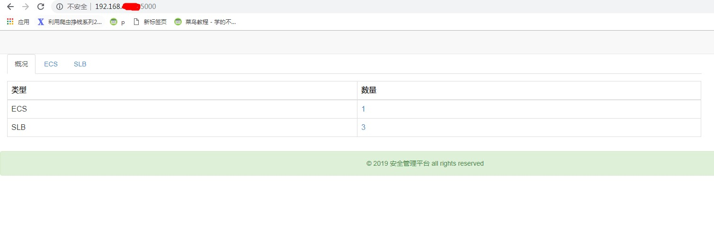
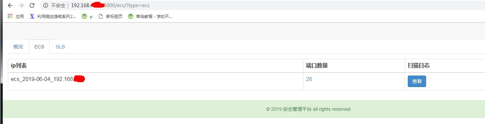
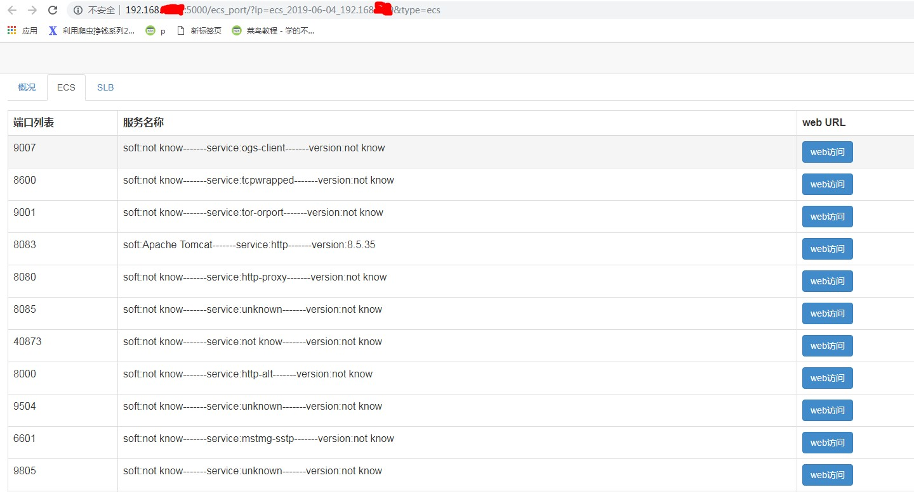
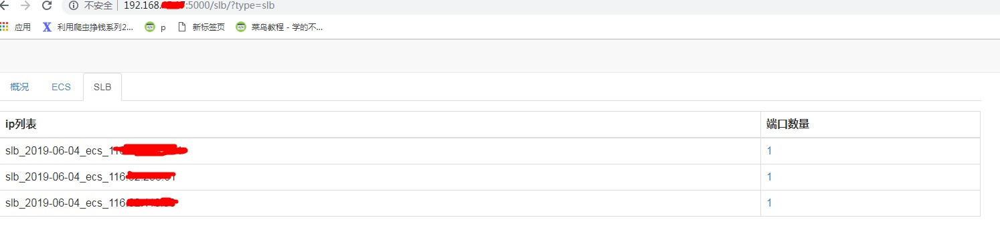
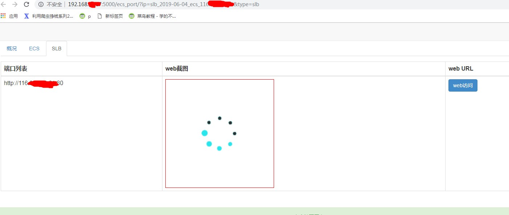

# 易巡

**解决的痛点:**   
    1.目前很多中小型公司都是基于阿里云的基础服务来构建自己的应用，比如在开发、生产的过程中使用了大量的ECS,SLB,但由于没有足够的安全意识或没有专职的安全人员，很有可能将一些不应该对外开放的端口，直接暴露在了公网，这样的操作很容易导致，未授权访问，进而导致敏感信息泄露或者直接被黑。 
    2.中小型企业的ECS，SLB的资产数量很多，手工通过浏览器去验证多个阿里云账号下所有的ECS每个端口，有点不切实际，一款自动化的巡扫工具能减轻重复劳动。  

**本软件只做初步探测，无攻击性行为。请使用者遵守《[中华人民共和国网络安全法](http://www.npc.gov.cn/npc/xinwen/2016-11/07/content_2001605.htm)》，勿将易巡用于非授权的测试，易宠SRC不负任何连带法律责任。**  

其主体分为三部分：SLB外网开放web端口扫描及浏览器模拟截图，ECS外网开放端口扫描，web界面查阅

安装环境： window/linux+python3+redis+selenium+django+nmap+masscan  
安装手册：   
1. 下载源码  
   git clone https://github.com/epet-com/yixun.git  
2. 安装python3及pip,redis-server  
   建议通过Anaconda安装python3
   可以通过docker来安装redis-server  
   $ docker  run -d -p 6379:6379 redis:3.2 redis-server  
3. 安装python3相应的扩展    
  pip -r install requirements.txt   
4. 安装chrome浏览器(no-headless) 及 驱动  
    参考：https://www.cnblogs.com/taurusfy/p/8464602.html, 并添加到PATH路径中  
    根据chrome浏览器的版本，选择合适的驱动下载，并添加到PATH路径中  
    http://npm.taobao.org/mirrors/chromedriver  
5. 安装masscan和nmap
    1.github:https://github.com/robertdavidgraham/masscan ,将可执行文件添加到PATH路径中   
    2.已经将可执行文件放入到项目的masscan中
    3.namp下载地址：https://nmap.org/download.html，将可执行文件添加到PATH路径中
6. 修改config.ini配置  
    [redis]     #redis配置  
    [aliyun_ak] #阿里云账号的ak  
    [img_site]  #扫描日志的域名  
    [img_dir]   #浏览器截图目录,建议设置为【扫描日志的域名】的根目录  
    [timeout]   #设置selenium的模拟浏览器的超时时间  
7. 建议在计划任务中增加周期性扫描任务    
  eg：* * * * * /usr/local/bin/python3 ecs_scan.py      >> ecs_scan.log 2>&1  
  eg：* * * * * /usr/local/bin/python3 ecs_slb.py       >> slb_scan.log 2>&1
8. 修改django的配置文件settings.py中的ALLOWED_HOSTS成主机ip
9. 启动web服务
   python3 manage.py runsever 主机ip:5000
 
 //todo   
 1.多进程扫描=> 分布式任务调度扫描  已实现
 2.多个阿里云账号统一管理  已实现
 3.钉钉/邮箱报警  已实现
 4.容器化部署 已实现
 
 可以加wx:cqwanhl详聊
 
 项目截图：
 
  
   
    
     
